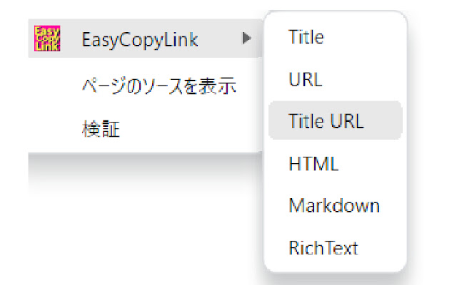
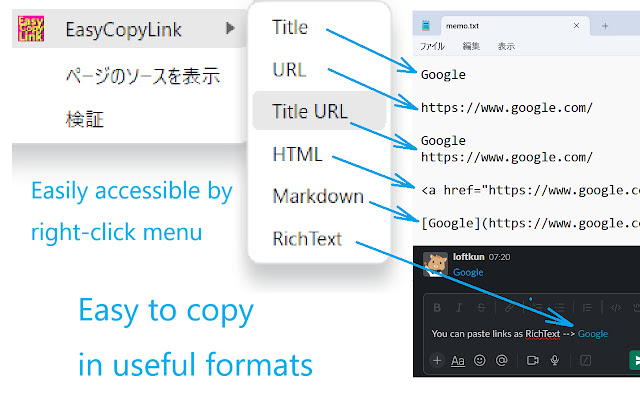

# EasyCopyLink

## overview

This is chrome extension that allows you to copy page link from right-click menu to clipboard in various formats.

It works with Edge as well as Chrome.

## install

Please install from [chrome web store](https://chrome.google.com/webstore/detail/easycopylink/bgilfgebpgfenjmenobinigndpommjke?hl=en).

## screenshots

## available formats

The available formats that can be copied are as follows:

- Title
- URL
- Title + newline + URL
- HTML
- Markdown
- RichText

"RichText" is a text with link that can be clicked on to open in a browser, making it useful for pasting into chat rooms such as Slack.

## Notes

This extension does not work on special pages as followings, due to the functional limitations of the Chrome extension API ( `chrome.scripting.executeScript` ).

- Chrome settings page ( `chrome://` )
- Chrome Web Store ( `https://chromewebstore.google.com` )
